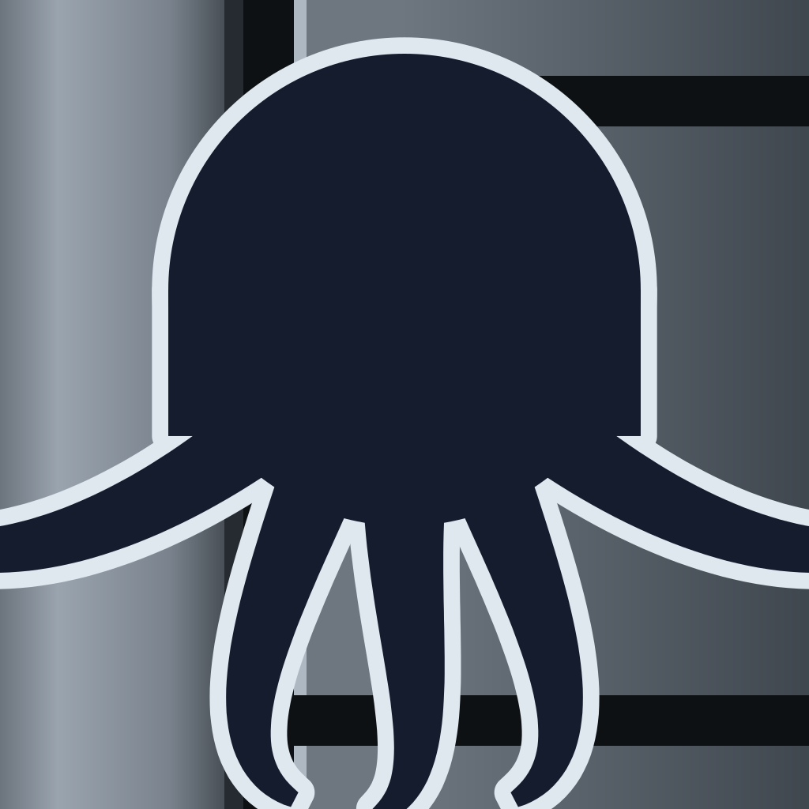

# Fediqo

[English](README.md) | [繁體中文](README.zh-TW.md)

> One timeline. Every network.

Fediqo is a unified social client for the open social web, bringing social networks together in one place.
Follow multiple timelines, manage conversations, and publish content across platforms from a single, native experience.

## The concept

| Principle            | What it means                                                       |
| -------------------- | ------------------------------------------------------------------- |
| client-only          | no server of ours — your device talks to your networks, nobody else |
| open protocols       | any protocol anyone can implement and host — all of them, in time   |
| merged, not repeated | one post from several places is one row, not several                |
| timeline first       | one stream in one order — by hashtag, by author, by servers you needn't join |
| post once            | one composer, several networks, one entry in your own timeline      |
| manage what is yours | your posts, and your server where it lets you                       |
| keep it here         | what you keep, and what you wrote, stays here — untold, unrotated   |
| work it out here     | trends and summaries from what you kept, computed on your device    |

## How it is built

| Practice    | What it means                                                     |
| ----------- | ------------------------------------------------------------------ |
| native      | Swift on Apple platforms — no web view, no cross-platform runtime |
| open source | AGPL-3.0, buildable from this checkout, so the claim can be checked |

## The mark

An octopus in front of a machined chassis. One creature with its arms in several places at
once, which is the whole idea; the metal behind it keeps the slots the timeline was drawn as
before the creature arrived.

The artwork is in [`assets/`](assets/) — `logo.svg` from 64 px up, `logo-small.svg` below
that, where every metal edge is snapped to the pixel grid and the arms are thickened so they
survive at 16 px, and `mascot.svg` for where the creature is the subject rather than the icon.
[`assets/README.md`](assets/README.md) says why each drawing is the way it is.

## DDD (Dream-Driven Development)

This project is based on the DDD (dream-driven development) methodology which means the project
is based on what I dream of.

All the features are based on my needs and my dreams.

## License

Fediqo is licensed under the GNU Affero General Public License v3.0 — see [`LICENSE`](LICENSE)
for the full text.

Copyright (C) 2026 cmj <cmj@cmj.tw>

The project deliberately keeps a single copyright holder, so that an App Store exception clause
can be added later if iOS distribution requires it.
